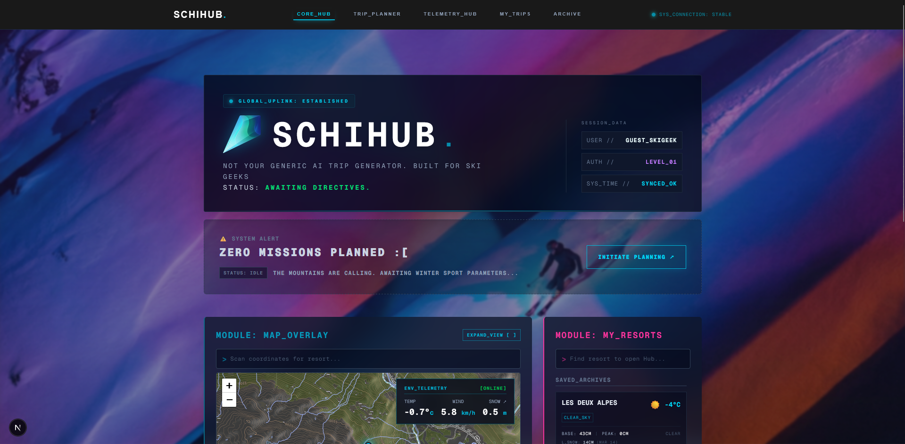

# 🏔️ SchiHub (Powered by SkiGem Orchestra)

> **GLOBAL_UPLINK: ESTABLISHED.** > Welcome to SchiHub, a multi-agent AI system designed to scour the hidden holes of the internet to plan the ultimate winter sports missions. 

Built with a heavily stylized, terminal-inspired Next.js frontend and a Python multi-agent backend, this system uses an "orchestra" of specialized AI agents to plan, scrape, and evaluate the perfect ski holiday based on highly specific user telemetry. It tracks upcoming deployments, active missions, and archives past runs.



---

## ✨ System Features

* **Mission Control Dashboard:** A dynamic, cyberpunk-inspired UI (Next.js/React) that tracks your upcoming trips, active deployments, and past mission archives.
* **The Trip Orchestrator:** A multi-phase planning sequence that guides you through:
  * *Phase 01 (Target Selection):* AI-driven resort scouting based on criteria (e.g., vertical drop, slope length, region).
  * *Phase 02A (Basecamp Hunt):* Deep-web chalet hunting via automated scraping.
  * *Phase 02B (Mission Targets):* Bucketlist run and couloir planning.
  * *Phase 03 (Final Review):* Mission briefing and sign-off.
* **Deep-Web Chalet Hunting:** Finds standalone chalets on global sites, local tourism boards, independent property sites, and niche forums using headless browsers.
* **Intelligent Evaluation:** Scores found chalets and resorts against strict user requirements (price limits, walking distance to ski lifts, snow reliability).

---

## 🏗️ Architecture (The AI Orchestra)

The backend is powered by **CrewAI / LangGraph**, orchestrating three distinct agents:

1. **The Resort Scout ⛷️:** Uses search APIs and ski-resort databases to find regions that match the overarching criteria.
2. **The Chalet Hunter 🏡:** Takes the resort list and uses web-scraping tools (Playwright/BeautifulSoup) to crawl local websites, Google Maps data, and independent booking sites for chalets.
3. **The Evaluator ⚖️:** Parses the scraped data (price, distance to lift, amenities) and filters out anything that doesn't perfectly match the user's mission parameters.

---

## 🛠️ Tech Stack

### Frontend (Mission Control)
* **Framework:** Next.js (App Router), React, TypeScript
* **Styling:** Tailwind CSS (Terminal/Cyberpunk aesthetic, glowing borders, Michroma/Mono fonts)
* **State Management:** React Context (`SearchContext`), custom hooks

### Backend (AI Core)
* **Framework:** Python, FastAPI (API layer for trips and agent triggers)
* **AI Orchestration:** CrewAI / LangGraph
* **LLM:** Groq API (e.g., `llama-3.3-70b-versatile`)
* **Tools:** Playwright (Web Scraping), Tavily/Serper (Web Search)
* **Database:** Local DB via FastAPI (managing Trips, Legs, and User IDs)

---

## 🚀 Getting Started

### Prerequisites
* Node.js (v18+)
* Python (3.11+)
* API Keys: Groq/OpenAI, Tavily/Serper

### Installation

1. **Clone the repository & enter the uplink**
   ```bash
   git clone [https://github.com/rutgerberger/snowgem-orchestra.git](https://github.com/rutgerberger/snowgem-orchestra.git)
   cd snowgem-orchestra

2. **Initialize the Backend Core**
   ```bash
   cd backend
   python -m venv venv
   source venv/bin/activate  # Or `venv\Scripts\activate` on Windows
   pip install -r requirements.txt
   cp .env.example .env      # Add your API keys here
   uvicorn app.main:app --reload

3. **Initialize the Frontend UI**
   ```bash
   cd ../frontend
   npm install
   npm run dev

The system will now be active on http://localhost:3000.
